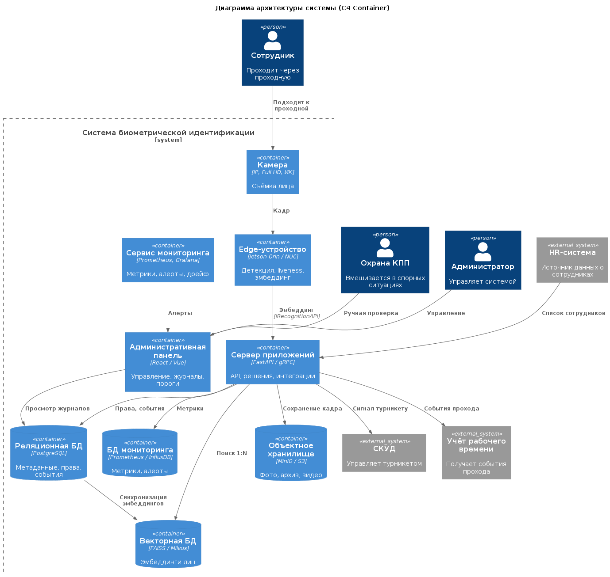

# Диаграмма архитектуры системы (C4 Container)

**Нотация:** C4 Model, уровень контейнеров  
**Назначение:** описание архитектуры системы биометрической идентификации с учётом распределённого характера хранения данных.

---

## Внешние участники

| Участник | Роль |
|---|---|
| Сотрудник | Проходит через проходную |
| Охрана КПП | Вмешивается при низкой уверенности |
| Администратор | Управляет системой |

---

## Внешние системы

| Система | Назначение |
|---|---|
| HR-система | Источник данных о сотрудниках |
| СКУД | Управляет турникетом |
| Учёт рабочего времени | Получает события прохода |

---

## Контейнеры системы

| Контейнер | Уровень | Назначение |
|---|---|---|
| Камера | Edge | Съёмка лица |
| Edge-устройство | Edge | Детекция, liveness, эмбеддинг |
| Сервер приложений | Central | API, решения, интеграции |
| Административная панель | Central | Управление, журналы, пороги |
| Сервис мониторинга | Central | Метрики, алерты, дрейф |

---

## Хранилища данных

| Хранилище | Что хранит | Почему отдельно |
|---|---|---|
| Векторная БД | Эмбеддинги лиц | Быстрый поиск ближайших соседей |
| Реляционная БД | Метаданные, права, события | Транзакционность, связи |
| Объектное хранилище | Фото, архив | Большие объёмы, редкие изменения |
| БД мониторинга | Метрики, алерты | Временные ряды |

---

## Диаграмма

