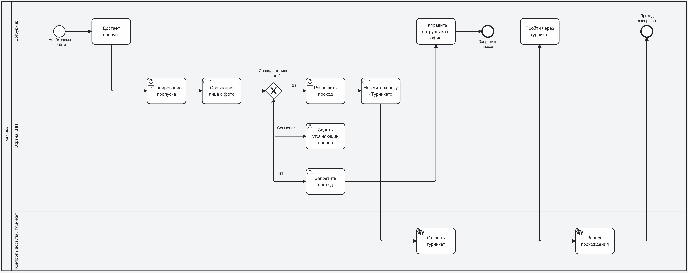

# AS-IS. Текущий процесс контроля доступа

**Нотация:** BPMN 2.0  
**Назначение:** описание процесса проверки личности на проходной до внедрения системы.

**Участники:** Сотрудник, Охрана КПП, Контроль доступа / Турникет.

**Ключевые шаги:**
1. Сотрудник достаёт пропуск и предъявляет его охране.
2. Охрана сканирует пропуск и визуально сравнивает лицо с фото.
3. При совпадении — разрешает проход и открывает турникет.
4. При сомнении — задаёт уточняющий вопрос.
5. При несовпадении — запрещает проход.
6. Турникет открывается, фиксируется прохождение.

**Проблемные точки:** человеческий фактор, субъективность, низкая скорость, отсутствие полного журнала, уязвимость к чужому пропуску.

