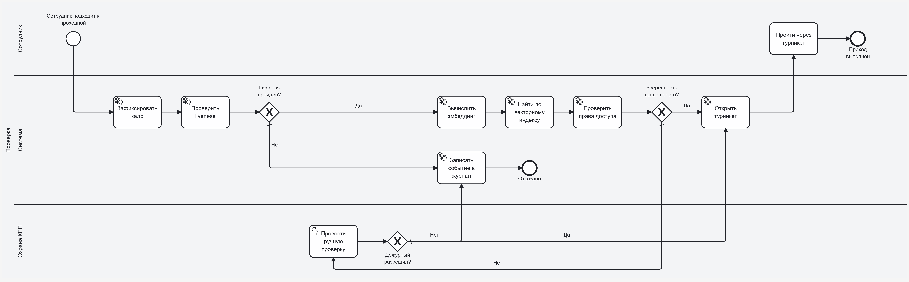

# TO-BE. Целевой процесс контроля доступа

**Нотация:** BPMN 2.0  
**Назначение:** описание процесса после внедрения системы биометрической идентификации.

**Участники:** Сотрудник, Система, Охрана КПП.

**Ключевые шаги:**
1. Сотрудник подходит к проходной, камера фиксирует кадр.
2. Система проверяет liveness, вычисляет эмбеддинг, ищет по векторному индексу и проверяет права доступа.
3. При уверенности выше порога — турникет открывается автоматически.
4. При низкой уверенности — сигнал охране для ручной проверки.
5. При несоответствии liveness или отказе дежурного — событие записывается в журнал, доступ запрещён.
6. Каждое событие журналируется, метрики передаются в мониторинг.

**Что меняется:** автоматическая проверка вместо визуальной, liveness, полное журналирование, снижение роли человеческого фактора, целевое время прохода ≤ 2 сек.

