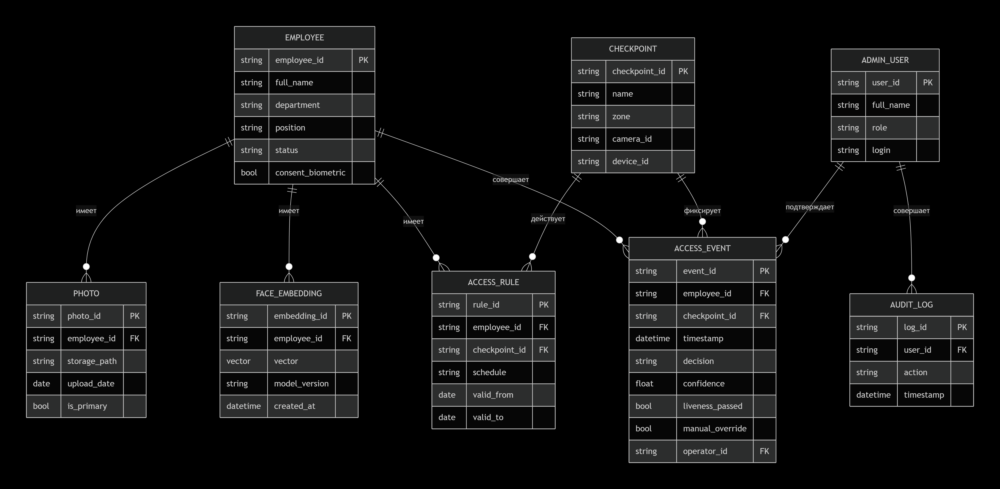

# ER-диаграмма структуры данных

**Нотация:** Crow's Foot (вороньи лапки)  
**Назначение:** описание структуры данных системы биометрической идентификации с учётом распределённого характера хранения.

---

## Сущности и хранилища

| Сущность | Назначение | Хранилище |
|---|---|---|
| Employee | Сотрудник предприятия | Реляционная БД (PostgreSQL) |
| Photo | Эталонная фотография | Объектное хранилище (MinIO / S3) |
| FaceEmbedding | Векторное представление лица | Векторная БД (FAISS / Milvus / Qdrant) |
| Checkpoint | Проходная | Реляционная БД |
| AccessRule | Правило доступа | Реляционная БД |
| AccessEvent | Событие прохода | Реляционная БД + архив |
| AdminUser | Пользователь системы (охрана, оператор, администратор) | Реляционная БД |
| AuditLog | Лог действий администратора | Реляционная БД |

---

## Атрибуты сущностей

**Employee**
- `employee_id` (PK) — табельный номер
- `full_name` — ФИО
- `department` — подразделение
- `position` — должность
- `status` — статус (активен / уволен)
- `consent_biometric` — согласие на обработку биометрии

**Photo**
- `photo_id` (PK)
- `employee_id` (FK)
- `storage_path` — путь в объектном хранилище
- `upload_date`
- `is_primary` — основное ли фото

**FaceEmbedding**
- `embedding_id` (PK)
- `employee_id` (FK)
- `vector` — вектор фиксированной размерности
- `model_version`
- `created_at`

**Checkpoint**
- `checkpoint_id` (PK)
- `name` — название проходной
- `zone` — зона доступа
- `camera_id`
- `device_id`

**AccessRule**
- `rule_id` (PK)
- `employee_id` (FK)
- `checkpoint_id` (FK)
- `schedule` — расписание (смена)
- `valid_from`
- `valid_to`

**AccessEvent**
- `event_id` (PK)
- `employee_id` (FK)
- `checkpoint_id` (FK)
- `timestamp`
- `decision` — разрешено / запрещено / ручная проверка
- `confidence` — уверенность модели
- `liveness_passed`
- `manual_override` — было ли вмешательство охраны
- `operator_id` (FK)

**AdminUser**
- `user_id` (PK)
- `full_name`
- `role` — охрана / оператор / администратор / аудитор
- `login`

**AuditLog**
- `log_id` (PK)
- `user_id` (FK)
- `action`
- `timestamp`

---

## Связи

| Связь | Тип | Описание |
|---|---|---|
| Employee → Photo | 1:N | У сотрудника несколько фото |
| Employee → FaceEmbedding | 1:N | У сотрудника несколько эмбеддингов |
| Employee → AccessRule | 1:N | У сотрудника несколько правил доступа |
| Employee → AccessEvent | 1:N | У сотрудника много событий прохода |
| Checkpoint → AccessRule | 1:N | Правило действует для проходной |
| Checkpoint → AccessEvent | 1:N | Через проходную много событий |
| AdminUser → AccessEvent | 1:N | Оператор подтверждает события |
| AdminUser → AuditLog | 1:N | Пользователь совершает много действий |

---

## Диаграмма

