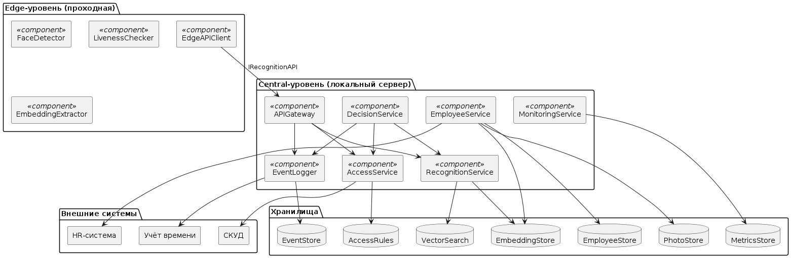

# UML-диаграмма компонентов

**Нотация:** UML 2.x Component Diagram  
**Назначение:** структурная организация системы — компоненты, их интерфейсы и зависимости.

**Пакеты:**
- Edge-уровень (проходная) — FaceDetector, LivenessChecker, EmbeddingExtractor, EdgeAPIClient.
- Central-уровень (локальный сервер) — APIGateway, DecisionService, EmployeeService, MonitoringService, EventLogger, AccessService, RecognitionService.
- Хранилища — EventStore, AccessRules, VectorSearch, EmbeddingStore, EmployeeStore, PhotoStore, MetricsStore.
- Внешние системы — HR-система, Учёт времени, СКУД.

**Ключевые зависимости:**
- EdgeAPIClient → APIGateway (IRecognitionAPI).
- APIGateway → RecognitionService, AccessService, EventLogger.
- RecognitionService → VectorSearch, EmbeddingStore.
- AccessService → AccessRules, СКУД.
- EventLogger → EventStore, Учёт времени.
- EmployeeService → EmployeeStore, PhotoStore, EmbeddingStore, HR.
- MonitoringService → MetricsStore.

