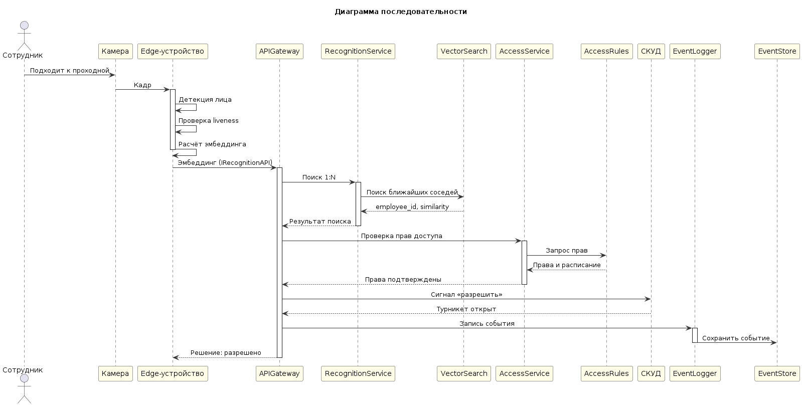

# UML-диаграмма последовательности

**Нотация:** UML 2.0 Sequence Diagram  
**Назначение:** описание основного сценария прохода сотрудника через проходную — от фиксации кадра до открытия турникета.

---

## Участники

| Участник | Роль |
|---|---|
| Сотрудник | Человек, проходящий через проходную |
| Камера | Фиксирует кадр |
| Edge-устройство | Детекция лица, проверка liveness, расчёт эмбеддинга |
| APIGateway | Единая точка входа на сервере |
| RecognitionService | Поиск 1:N по векторному индексу |
| VectorSearch | Векторная БД |
| AccessService | Проверка прав доступа |
| AccessRules | Хранилище прав |
| СКУД | Управление турникетом |
| EventLogger | Журналирование событий |
| EventStore | Хранилище событий |

---

## Последовательность шагов

| № | От | К | Сообщение |
|---|---|---|---|
| 1 | Сотрудник | Камера | Подходит к проходной |
| 2 | Камера | Edge-устройство | Кадр |
| 3 | Edge-устройство | Edge-устройство | Детекция лица |
| 4 | Edge-устройство | Edge-устройство | Проверка liveness |
| 5 | Edge-устройство | Edge-устройство | Расчёт эмбеддинга |
| 6 | Edge-устройство | APIGateway | Эмбеддинг (IRecognitionAPI) |
| 7 | APIGateway | RecognitionService | Поиск 1:N |
| 8 | RecognitionService | VectorSearch | Поиск ближайших соседей |
| 9 | VectorSearch | RecognitionService | employee_id, similarity |
| 10 | RecognitionService | APIGateway | Результат поиска |
| 11 | APIGateway | AccessService | Проверка прав доступа |
| 12 | AccessService | AccessRules | Запрос прав |
| 13 | AccessRules | AccessService | Права и расписание |
| 14 | AccessService | APIGateway | Права подтверждены |
| 15 | APIGateway | СКУД | Сигнал «разрешить» |
| 16 | СКУД | APIGateway | Турникет открыт |
| 17 | APIGateway | EventLogger | Запись события |
| 18 | EventLogger | EventStore | Сохранить событие |
| 19 | APIGateway | Edge-устройство | Решение: разрешено |

